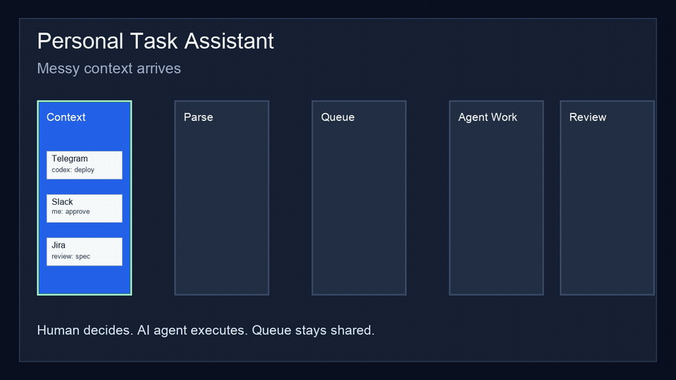

# Personal Task Assistant

Personal Task Assistant is an interface for collaboration between a person and an
AI agent. It turns tasks parsed by an agent or adapter into an operational queue,
assigns priority and execution roles, exposes agent-ready work for connected
agents to pick up, and keeps human-dependent tasks visible with minimal required
input.

It is connector-ready rather than locked to one source. User-provided adapters
can connect Jira, Asana, YouTrack, Linear, Trello, Slack, Telegram, email, or
other systems by calling the JSON API, forwarding webhook events, or running
scheduled polling jobs. Those source-specific adapters are intentionally left to
the user to implement and operate for their own accounts, permissions, and data
rules.

It is not another task tracker. It is the missing coordination layer for AI
agents: a place where humans decide, agents execute, and both sides share one
operational queue.



## Demo Workflow

1. A human sends messy context from Telegram, Slack, Jira, email, or a meeting note.
2. An agent or adapter turns that context into normalized tasks with owners,
   priority, source context, date set, and DD.
3. Codex-owned work moves into the agent queue so a connected AI agent can read
   it and start without another prompt.
4. Human-owned work stays visible as the smallest possible set of decisions,
   reviews, approvals, and missing inputs.
5. Finished agent work moves to `Waiting review`, so the human stays in control
   without manually tracking every agent action.

See concrete public examples in `docs/EXAMPLES.md`.

It provides:

- A web UI for reviewing, sorting, assigning, and completing human/AI tasks.
- A JSON API for agents and integrations to create, ingest, read, and update tasks.
- A connector contract with durable source health and ingestion-decision receipts.
- A reference Telegram polling adapter that demonstrates heartbeat reporting,
  ignored-item memory, fingerprint-aware replay, and idempotent task ingest.
- Opt-in Telegram Business ingestion: connect the bot to your own Telegram
  account (chat automation) and it read-only harvests task candidates from
  your private chats — direct asks and your own "ok, will do" commitments —
  as approve/skip cards, analyzed by a local headless Claude session.
- Database-backed storage, with SQLite for local development and Firestore for Google Cloud.
- Automatic DD estimates when the source did not provide a deadline.
- Reminder fields so missed tasks can be queried and notified.
- Role-oriented queues for agent-ready work, human input, review, blocked work,
  and unassigned tasks.

## Why It Matters

AI coding and operations agents can already perform real work, but teams still
lack a practical shared interface for deciding what the agent should do, what
requires a human, what is blocked, and what is ready for review. Personal Task
Assistant focuses on that collaboration boundary.

The project is intentionally small and inspectable: the UI is the operating
surface, the API is the agent contract, and adapters connect existing tools
without forcing users to move every workflow into one vendor ecosystem.

## Deploy It Yourself

The whole feature — your own board plus the daily AI worker — is a standalone
self-hostable unit:

```bash
git clone https://github.com/J3d1-fm/Personal-Task-Assistant.git
cd Personal-Task-Assistant
cp .env.example .env   # set TASK_TRACKER_API_KEY and SESSION_SECRET_KEY
docker compose up -d
```

That starts the tracker (with automatic schema migrations) and the daily
ritual: a prioritized digest of your board every day at `RITUAL_TIME`, and —
opt-in — an agent that works your queue and hands results back for review.
No Docker? Native macOS (launchd) and Linux (systemd/cron) schedules install
with `automation/install.sh`. Full guide, including the safety model of the
unattended agent: `docs/SELF_HOSTING.md`.

## Install For Non-Technical Users

The fastest path is to give this repository link to an AI coding agent and ask
it to follow `docs/AGENT_INSTALL.md`.

```text
Install this app for me:
https://github.com/J3d1-fm/Personal-Task-Assistant

Follow docs/AGENT_INSTALL.md. Use the local quick-start first. Do not add real
Jira, Asana, YouTrack, Slack, Telegram, email, OAuth, or cloud credentials unless
I explicitly provide them.
```

On macOS, a user can also download the repository and double-click
`install.command`. The installer creates `.venv`, installs dependencies, writes a
local `.env`, starts the app, and opens `http://127.0.0.1:8000`.

After the first setup, double-click `run-local.command` to start the local app
again. This Local Mode uses SQLite on your own machine and does not require
Google Cloud, Cloud Run, Firestore, or Google OAuth.

More details: `docs/INSTALLATION.md`.

Local-only details: `docs/LOCAL_MODE.md`.

## Local Development

```bash
python3 -m venv .venv
. .venv/bin/activate
pip install -r requirements.txt
cp .env.example .env
uvicorn app.main:app --reload
```

Open `http://127.0.0.1:8000`.
Use your own local `.env`; never commit real API keys, OAuth secrets, databases,
or service-account files.

The SQLite schema is managed with Alembic. Migrations run automatically at
startup, including a safe upgrade path for databases created by older releases.

Run lint and tests before sending changes; CI runs the same checks on GitHub:

```bash
pip install -r requirements-dev.txt
ruff check .
pytest
```

After changing the MCP tool surface, also run the agent evaluation process in
`evals/` — a deterministic ground-truth check plus an optional LLM run that
measures whether an agent can operate the board through the MCP tools alone.
See `evals/README.md`.

## Daily Automation And Reflexes

`automation/` gives the assistant a pulse and a voice:

- **Daily ritual** (15:00 local): always writes a prioritized digest (overdue,
  waiting-your-review, blocked, unassigned, agent queue); with the opt-in
  agent work loop enabled, an agent also claims codex tasks and finishes them
  to `waiting_review` for your approval. The agent can run entirely locally
  through a headless Claude Code session on your existing subscription
  (`WORK_RUNNER=claude` — no API key, no per-token billing) or over the
  Anthropic API; either way the safety rails are enforced in the MCP server
  itself (worker mode: never closes tasks, claim budget).
- **Telegram delivery**: with `TELEGRAM_BOT_TOKEN` and
  `TELEGRAM_NOTIFY_CHAT_ID` set, the digest arrives as a Telegram message
  instead of only landing in a log file — optionally with a spoken voice-note
  version (`TELEGRAM_DIGEST_VOICE=1`, macOS).
- **Watch loop** (`automation/watch.py`, opt-in): polls the board every ~30s
  and reacts between rituals — pushes due reminders, announces tasks entering
  `waiting_review` with inline ✅ Done / 🔁 Rework / ✋ Block buttons you can
  press from your phone, and (with `WATCH_WORK=1`) kicks the agent work loop
  the moment a task is assigned to it instead of waiting for 15:00.

Button presses travel back through the Telegram polling adapter and update
the task over the normal API — approving a review from your phone closes the
human-in-the-loop cycle from anywhere. You can also just **reply to any bot
message about a task** («закрыто, пароль сменили», "done", "block — waiting
on access", or any free-text note): the reply's first word picks the action
and the whole text lands on the task as a dated note. **Voice works too** —
voice notes are transcribed on-device (ffmpeg + whisper, no cloud) and follow
the same rules: a voice reply acts on that task, a standalone voice note
becomes a new task, and the bot echoes what it heard. Closing a task remains
exclusively a human action: agents still cannot set `done`; the ✅ button and
your reply are your finger, not the agent's.

Install with `automation/install.sh` (daily ritual) and
`automation/install.sh --watch` (watch loop); full details and the safety
model are in `automation/README.md`.

## Login And Auth

Local Mode uses local development auth when Google OAuth is not configured and
the app runs on `127.0.0.1`. The app itself only auto-signs-in requests that
arrive from the loopback interface; any other client sees the auth setup page.
Still, do not expose Local Mode through `--host 0.0.0.0`, LAN access, or a
public tunnel unless you configure real authentication.

For hosted or shared deployments, protect the web UI with Google OAuth. Create
OAuth credentials in Google Cloud Console and add this redirect URI:

```text
http://127.0.0.1:8000/auth/google/callback
```

For Cloud Run, add the deployed callback URL too:

```text
https://<cloud-run-url>/auth/google/callback
```

Then set:

```bash
GOOGLE_OAUTH_CLIENT_ID=...
GOOGLE_OAUTH_CLIENT_SECRET=...
ALLOWED_GOOGLE_EMAILS=your-email@gmail.com
SESSION_SECRET_KEY=long-random-secret
PUBLIC_BASE_URL=http://127.0.0.1:8000
SESSION_COOKIE_HTTPS=false
```

The JSON API still supports `Authorization: Bearer <TASK_TRACKER_API_KEY>` for Codex,
reminder jobs, and external ingestion.

## API

Set `TASK_TRACKER_API_KEY` in `.env`. API clients must send:

```http
Authorization: Bearer <key>
```

Main endpoints:

- `GET /readyz`
- `GET /api/tasks` (supports `limit` and `offset` pagination)
- `POST /api/tasks`
- `PATCH /api/tasks/{task_id}`
- `DELETE /api/tasks/{task_id}`
- `GET /api/agent/queue`
- `GET /api/agent/queue/summary`
- `POST /api/agent/triage/next`
- `POST /api/agent/triage/apply`
- `POST /api/agent/claim`
- `POST /api/agent/tasks`
- `POST /api/agent/ingest/context`
- `POST /api/ingest/context`
- `GET /api/reminders/due`

`POST /api/agent/claim` atomically hands the top-ranked Codex backlog task to
the calling agent and moves it to `in_progress`, so several parallel agents
never pick up the same work item.

`POST /api/agent/triage/next` + `POST /api/agent/triage/apply` power the
human-in-the-loop review: the first serves the next batch of smart-ranked cards
(stamping `last_shown_at` so batches never repeat), the second applies a whole
list of human resolutions — done / cancel / defer / block / assign / update,
each with an optional dated note — in one call. See `docs/API.md`.

For day-to-day PM usage, see `docs/PM_GUIDE.md`. For integration examples, see
`docs/API.md`.

## Integration Model

Personal Task Assistant does not ship with built-in Jira, Asana, YouTrack,
Slack, Telegram, or email credentials. Instead, integrations should be built as
small adapters controlled by the user:

- Webhook adapters receive events from systems such as Jira, Asana, YouTrack, or Slack and call `POST /api/agent/ingest/context`.
- Polling adapters periodically read systems such as Telegram, email, or task trackers and create normalized tasks through `POST /api/agent/tasks`.
- Sync adapters can read `GET /api/agent/queue` and update external tools through their own APIs.

The app supplies the task model, prioritization surface, DD defaults, and agent
queue API. The user remains responsible for implementing each external adapter,
storing its credentials safely, and deciding what data is allowed to enter the
assistant.

Adapters can pass an optional `external_id` (for example
`telegram:<source_hash>:<chat_id>:<message_id>:<task_hash>:<occurrence>`) with each task. Ingest is then
idempotent: replayed webhooks, lost adapter state, or retried polling runs
report the existing task as a duplicate instead of creating a second copy.

### MCP Server

The repository includes an MCP server in `adapters/task_assistant_mcp.py` that
exposes the JSON API as Model Context Protocol tools. Claude Code, Claude
Desktop, and any other MCP client can read the queue, atomically claim work,
create and update tasks, and ingest context — no custom adapter code needed.
The tool set mirrors the product workflow: `claim_task` -> do the work ->
`finish_task` (waiting review), so the human stays in the loop.

Setup and the full tool list: `docs/MCP.md`.

### Reference Adapter

The repository includes a Telegram polling adapter in
`adapters/telegram_polling_adapter.py`. It is a safe reference implementation for
the connector model:

- reads Telegram Bot API updates with a user-provided bot token;
- extracts prefixed task lines such as `codex:`, `me:`, `review:`, and `todo:`;
- sends normalized tasks to `POST /api/agent/ingest/context`;
- stores only a local update offset and never commits credentials.

See `adapters/README.md` for setup.
See `docs/ADAPTER_CONTRACT.md` for the complete reusable adapter contract.

## Roadmap

The public roadmap lives in GitHub Issues. Launch copy and posting checklist are
in `docs/LAUNCH.md`. The first milestones are:

- stronger demo material and public examples;
- Telegram, Slack, Jira, Asana, and YouTrack adapter patterns;
- agent execution lifecycle states;
- safer onboarding for non-technical users;
- public templates for human/AI task operating rhythms.

## Google Cloud

The intended production shape is Cloud Run + Firestore.

Use `deploy/gcloud.example.sh` as a deployment checklist after creating a GCP project,
Artifact Registry repository, Firestore database, and Secret Manager secrets.

For Cloud Run set:

```bash
PUBLIC_BASE_URL=https://<cloud-run-url>
SESSION_COOKIE_HTTPS=true
TASK_STORE=firestore
```

## License

MIT. See `LICENSE`.
